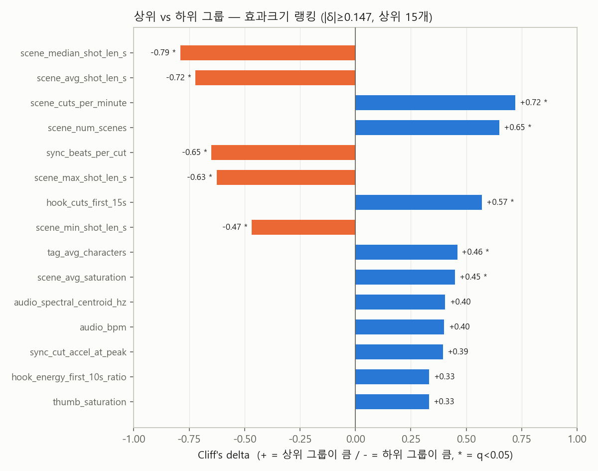
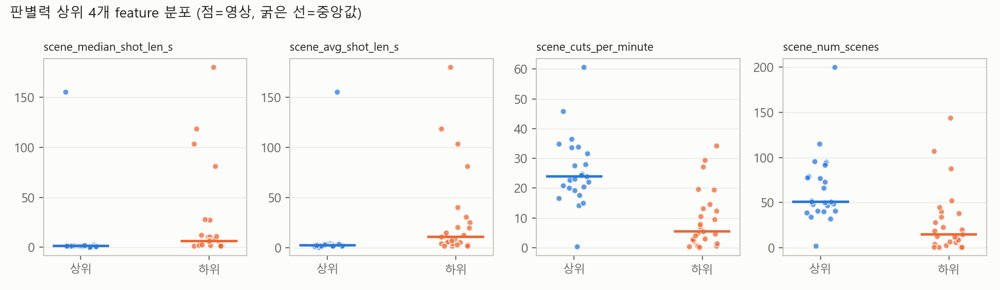

# P5 통계 분석 리포트 — 보컬로이드 MV 상·하위 극단 비교

생성: 2026-07-16 · 표본: 상위 25 / 하위 25 (조회수/구독자수 비율 극단, 채널당 최대 2편) · features 86컬럼

## 0. 요약

- 수치형 40개 비교 중 BH-FDR q<0.05 유의: **10개**, |δ|≥0.33(중간 이상 효과): 15개
- 해석 한계(스펙 §7): 인과 주장 불가 · 극단 그룹 설계로 효과크기 과대추정 경향 · 일반화 범위는 2025-04~2026-04 보컬로이드 신곡

## 1. 수치형 feature — 효과크기 랭킹

| feature | 상위 중앙값 | 하위 중앙값 | Cliff's δ | 크기 | p | q(BH) |
|---|---|---|---|---|---|---|
| scene_median_shot_len_s | 1.5 | 6.21 | -0.790 | 큼 | 0.0000 | 0.0001 **✓** |
| scene_avg_shot_len_s | 2.51 | 10.97 | -0.722 | 큼 | 0.0000 | 0.0002 **✓** |
| scene_cuts_per_minute | 23.9 | 5.5 | +0.722 | 큼 | 0.0000 | 0.0002 **✓** |
| scene_num_scenes | 51 | 15 | +0.650 | 큼 | 0.0001 | 0.0007 **✓** |
| sync_beats_per_cut | 5.3 | 18.9 | -0.650 | 큼 | 0.0001 | 0.0007 **✓** |
| scene_max_shot_len_s | 12.38 | 35.54 | -0.626 | 큼 | 0.0002 | 0.0010 **✓** |
| hook_cuts_first_15s | 5 | 2 | +0.571 | 큼 | 0.0005 | 0.0029 **✓** |
| scene_min_shot_len_s | 0.62 | 0.83 | -0.467 | 중간 | 0.0047 | 0.0233 **✓** |
| tag_avg_characters | 1.24 | 0.95 | +0.459 | 중간 | 0.0055 | 0.0244 **✓** |
| scene_avg_saturation | 0.362 | 0.25 | +0.450 | 중간 | 0.0066 | 0.0264 **✓** |
| audio_spectral_centroid_hz | 2,764 | 2,444 | +0.405 | 중간 | 0.0145 | 0.0512 |
| audio_bpm | 136 | 112.3 | +0.400 | 중간 | 0.0154 | 0.0512 |
| sync_cut_accel_at_peak | 1.04 | 0.63 | +0.394 | 중간 | 0.0229 | 0.0703 |
| hook_energy_first_10s_ratio | 0.831 | 0.729 | +0.333 | 중간 | 0.0446 | 0.1195 |
| thumb_saturation | 0.407 | 0.321 | +0.331 | 중간 | 0.0457 | 0.1195 |
| scene_avg_brightness | 0.579 | 0.463 | +0.328 | 작음 | 0.0478 | 0.1195 |
| thumb_brightness | 0.663 | 0.473 | +0.317 | 작음 | 0.0560 | 0.1317 |
| sync_first_cut_s | 1.83 | 4.17 | -0.310 | 작음 | 0.0740 | 0.1345 |
| tag_closeup_ratio | 0.537 | 0.333 | +0.306 | 작음 | 0.0650 | 0.1345 |
| lyrics_first_vocal_at_s | 0 | 4 | -0.301 | 작음 | 0.0635 | 0.1345 |
| audio_rms_mean | 0.254 | 0.206 | +0.299 | 작음 | 0.0712 | 0.1345 |
| audio_lufs_i | -11.6 | -13.6 | +0.286 | 작음 | 0.0839 | 0.1460 |
| thumb_num_characters | 1 | 1 | +0.269 | 작음 | 0.0696 | 0.1345 |
| lyrics_lyric_lines_per_min | 12.3 | 8.1 | +0.267 | 작음 | 0.1073 | 0.1788 |
| lyrics_n_lyric_lines | 29 | 21 | +0.259 | 작음 | 0.1181 | 0.1838 |
| title_bracket_segments | 0 | 0 | -0.208 | 작음 | 0.1195 | 0.1838 |
| audio_rms_std | 0.091 | 0.076 | +0.200 | 작음 | 0.2290 | 0.3158 |
| tag_wide_ratio | 0.149 | 0.318 | -0.200 | 작음 | 0.2285 | 0.3158 |
| sync_cut_on_beat_ratio | 0.366 | 0.4 | -0.175 | 작음 | 0.3156 | 0.4208 |
| audio_onsets_per_sec | 3.61 | 3.39 | +0.125 | 무시 | 0.4550 | 0.5872 |
| title_exclaim_count | 0 | 0 | +0.123 | 무시 | 0.1565 | 0.2319 |
| title_len | 26 | 32 | -0.102 | 무시 | 0.5409 | 0.6761 |
| audio_lra_lu | 4.1 | 4.6 | -0.078 | 무시 | 0.6413 | 0.7773 |
| tag_lyrics_text_ratio | 0.779 | 0.778 | +0.064 | 무시 | 0.7048 | 0.8291 |
| duration_s | 147 | 160 | -0.054 | 무시 | 0.7488 | 0.8558 |
| upload_hour | 3 | 3 | +0.027 | 무시 | 0.8744 | 0.9715 |
| lyrics_text_frame_ratio | 0.493 | 0.421 | +0.021 | 무시 | 0.9073 | 0.9809 |
| sync_cut_beat_offset_med_s | 0.114 | 0.118 | +0.008 | 무시 | 0.9736 | 1.0000 |
| audio_peak_energy_ratio | 0.769 | 0.701 | -0.006 | 무시 | 0.9768 | 1.0000 |
| lyrics_first_lyric_at_s | 4 | 4 | -0.002 | 무시 | 1.0000 | 1.0000 |

## 2. 이진 feature (Fisher exact)

| feature | 상위 | 하위 | p |
|---|---|---|---|
| title_has_emoji | 2/25 | 0/25 | 0.4898 |
| title_has_mv_mark | 3/25 | 2/25 | 1.0000 |
| was_premiere | 13/25 | 4/25 | 0.0157 |
| has_nico_link | 4/25 | 4/25 | 1.0000 |
| lyrics_has_hardsub | 23/25 | 18/25 | 0.1383 |
| thumb_has_text | 9/25 | 24/25 | 0.0000 |

## 3. 범주형 분포 (그룹별 상위 4)

| feature | 상위 그룹 | 하위 그룹 |
|---|---|---|
| tag_mood_top | 활기 16, 긴장 4, 분노 2, 평온 2 | 평온 8, 슬픔 7, 활기 7, 긴장 2 |
| thumb_mood | 활기 17, 슬픔 5, 분노 1, 평온 1 | 슬픔 9, 평온 7, 활기 7, 신비 1 |
| lyrics_topic_1 | 이별 13, 자기긍정 3, 사랑 3, 일상 3 | 이별 9, 희망 7, 어둠/절망 4, 판타지 1 |
| lyrics_sentiment | 부정 17, 긍정 6, 양가 1 | 부정 13, 긍정 9, 중립 1 |
| lyrics_addressee | 1인칭 독백 22, 3인칭 관찰 1, 2인칭 대상 1 | 1인칭 독백 21, 2인칭 대상 2 |
| lyrics_source | ocr 20, asr 5 | ocr 17, asr 8 |
| audio_key | G minor 4, F minor 3, F# minor 3, F# major 2 | E minor 3, D# major 2, F minor 2, F# major 2 |
| upload_weekday | 4 11, 5 6, 2 3, 3 2 | 4 11, 2 3, 5 3, 6 3 |

## 4. 교란변수 점검

| 변수 | 상위 중앙값 | 하위 중앙값 | δ | p |
|---|---|---|---|---|
| subscriber_count | 77,200 | 61,800 | +0.187 | 0.2603 |
| channel_video_count | 23 | 93 | -0.752 | 0.0000 |

주: 구독자수는 비율 지표의 분모라 그룹 간 차이가 있으면 채널 규모 효과가 잔존한다는 뜻 — 해석 시 반드시 참조.

## 5. 해석 (연구 질문에 대한 답)

### 5.1 뜬 곡들의 공통 프로파일 (형태 1 — 상위 25편 서술)

- **빠른 컷 리듬이 가장 강한 신호**: 상위 그룹 중앙값 분당 23.9컷(샷 중앙값 1.5초), 첫 15초에 컷 5회. 비트 5.3개당 1컷.
- **밝고 채도 높은 화면 + "활기" 분위기**(25편 중 16), 등장인물 평균 1.24명(클로즈업 비율 0.54).
- **가사는 "이별" 주제·부정 정서·1인칭 독백**이 최빈 — 단 이건 하위 그룹도 유사(장르 관습, 5.2 참조).
- **패키징**: 썸네일에 텍스트 없는 일러스트 단독형이 다수(텍스트 있음 9/25), 프리미어 공개 13/25.

### 5.2 상·하위를 실제로 가르는 특징 (형태 2 — 검정 통과, q<0.05)

1. **편집 리듬 계열이 상위 7개를 독식** — 샷 길이(δ-0.79), 분당 컷(+0.72), 씬 수(+0.65), 비트당 컷(-0.65), 첫 15초 컷(+0.57). 하위 그룹(분당 5.5컷)과 4배 차이.
2. **화면 구성**: 등장인물 수(+0.46), 채도(+0.45).
3. **패키징 (Fisher)**: 썸네일 텍스트 **없음**이 상위와 강하게 동행 (상위 9/25 vs 하위 24/25, p<0.0001), 프리미어 공개(13/25 vs 4/25, p=0.016).
4. **장르 관습이라 판별력 없는 것**: 가사 주제·정서·1인칭 독백, 곡 길이, LUFS, 업로드 요일 — 상·하위 공통이므로 "인기 요인"이 아님.

### 5.3 반드시 함께 읽어야 할 한계

- **인과 아님**: "뜬 곡들은 컷이 빨랐다"이지 "컷을 빠르게 하면 뜬다"가 아니다. 빠른 컷·인물 작화량·프리미어는 모두 **제작 투자 규모의 프록시**일 수 있다.
- **채널 유형 교란 발견**: 하위 그룹 채널은 영상 수가 훨씬 많다(중앙값 93 vs 23, δ-0.75). 다작 채널의 편당 조회가 희석되는 구조 효과가 섞여 있을 수 있음 — 후속으로 채널 영상 수 통제(층화/매칭) 재분석 권장. 구독자수 자체는 균형(p=0.26, 비율 정규화 작동).
- 극단 그룹 설계라 효과크기는 과대추정 경향. 결론의 일반화 범위는 2025-04~2026-04 YouTube 원본 채널 보컬로이드 신곡.
- 썸네일 텍스트 발견은 역설적("텍스트 없어야 뜬다"로 읽지 말 것): 텍스트 없는 일러스트 단독 썸네일은 전속 일러스트레이터 기용 = 제작 규모의 프록시일 가능성이 높다.

