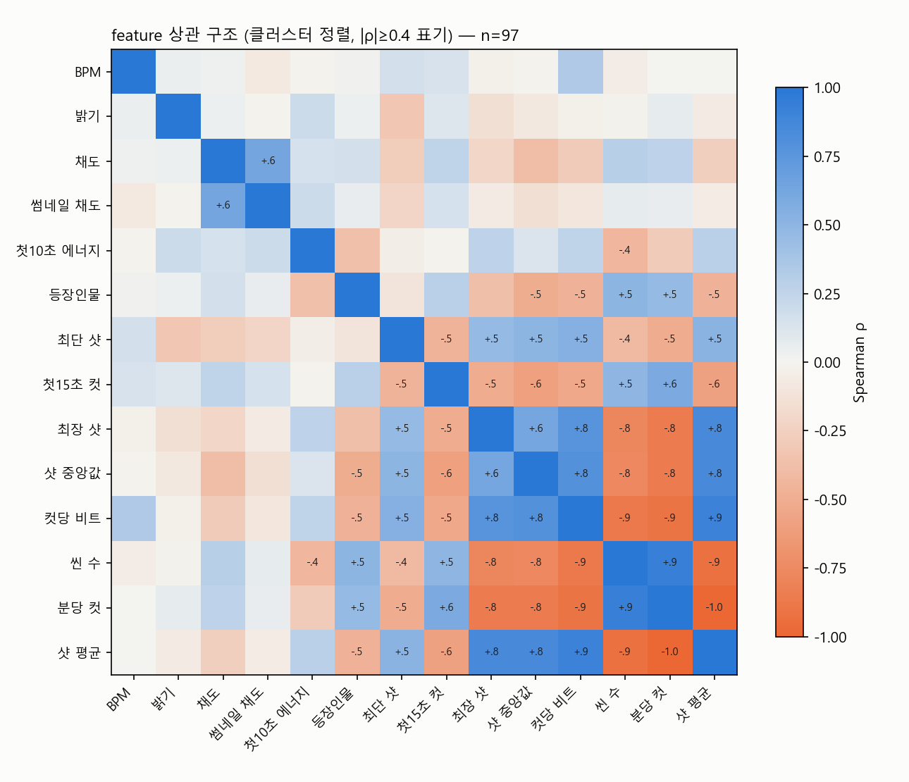

# feature 구조 검증 — 지표들은 서로 연결된 실질 구성개념인가

작성: 2026-07-21 · 표본: 두 도메인 합산 97편

## 1. 편집 리듬 7개는 하나의 구성개념이다
- 편집 리듬 블록(컷·샷 길이·씬 수·비트당 컷·훅 컷) 내부 평균 |ρ| = **0.69** — 개별 지표가 아니라 단일 잠재 요인('편집 템포')의 여러 측정치로 움직인다.
- 상관 히트맵에서 해당 블록이 한 클러스터로 묶임 (좌상단 블록).

## 2. 구성개념 간 연결 — '제작 투자' 상위 요인의 흔적
- 편집 템포 ↔ 화면 구성(인물·채도·밝기): ρ = **+0.27** (p=0.0078)
- 편집 템포 ↔ 썸네일 무텍스트: ρ = **+0.10** (p=0.3518)
- 서로 다른 제작 공정(편집/작화/패키징)의 지표가 동반 상승 — 개별 우연 상관이 아니라 공통 상위 요인(제작 투자·완성도)을 공유한다는 해석과 정합. 단, 이 요인 자체는 미측정(프록시 해석 유지).

## 3. 도메인 간 구조 재현성
- 보컬로이드 vs K-pop PC1 로딩 congruence = **0.96** (1.0 = 동일 구조). 0.85+ = 사실상 동일한 요인으로 간주하는 관례.
- 서로 다른 모집단에서 같은 상관 구조가 재현 → 이 연결은 표본 우연이 아니라 MV 제작의 일반 구조.

## 4. 극단 그룹 밖 연속 관계 (전체 표본, log 조회/구독)
| 도메인 | 구성개념 | Spearman ρ | p | n |
|---|---|---|---|---|
| vocaloid | 편집 템포 | +0.52 | 0.0001 | 50 |
| vocaloid | 화면 구성 | +0.39 | 0.0050 | 50 |
| kpop | 편집 템포 | +0.29 | 0.0525 | 45 |
| kpop | 화면 구성 | +0.18 | 0.2316 | 45 |

주: 표본이 극단 중심이라 순수 연속 검증은 아니나, 그룹 이분법을 쓰지 않은 순위 상관에서도 관계가 유지되는지의 1차 확인. 완전한 검증은 중간층 표본 추가 후.

## 결론
개별 지표들은 고립된 상관이 아니라 **'편집 템포'라는 단일 구성개념 + 이와 동반하는 화면·패키징 요인**으로 연결되며, 이 구조는 두 도메인에서 재현된다. 즉 이 데이터의 발견은 '여러 개의 우연'이 아니라 '하나의 일관된 제작 스타일 차이'를 측정한 것이다.
